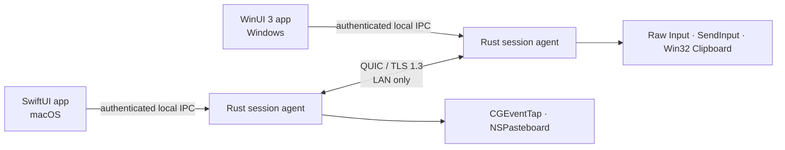

<!-- doc-id: readme; lang: en; revision: 9 -->

  
  <h1>Nodavo</h1>
  
<strong>One motion. Every machine.</strong>

  
Designing a secure, local-first, open-source software KVM for macOS and Windows.

  

    <a href="README.md">English</a> ·
    <a href="README.ru.md">Русский</a>
  

  

    
    
    
  

> [!IMPORTANT]
> Nodavo is under active pre-alpha implementation. There is no usable cross-machine build or public release yet. The Rust workspace and macOS shell compile for development, but the WinUI source has not yet been built on Windows, and the complete macOS ↔ Windows path, installers, and release qualification are not finished.

## Vision

Nodavo is being designed to make a Mac and a Windows PC feel like one local workspace. Move the pointer across a screen edge, keep typing on the other computer, and explicitly share clipboard content or files—without a cloud account or a remote relay.

The implementation will be written from scratch. Existing software KVM projects are used only as behavioral and interoperability references under the project's [clean-room policy](docs/clean-room-policy.md).

## Product principles

- **Local first:** direct peer-to-peer operation on a trusted local network.
- **Secure by default:** mutual authentication and encrypted transport; no plaintext mode.
- **Equal peers:** either computer can become the active input source.
- **Explicit data sharing:** separate permissions for input, clipboard, and files.
- **Native experience:** first-class macOS and Windows permission, tray, and update flows.
- **Honest open source:** documented protocol, public threat model, reproducible release evidence.

## Current implementation status

| Capability | 1.0 target | Current pre-alpha status |
| --- | --- | --- |
| Mouse and keyboard sharing | macOS ↔ Windows, both directions | Authenticated bidirectional session channels, focus leases, forced release, a wired macOS capture/injection bridge, and both native platform runtimes compile; the Windows agent bridge and real Mac ↔ PC hardware proof are missing |
| Seamless edge switching | Mixed DPI and multi-monitor layouts | Same-connection bidirectional focus switching and lease renewal pass virtual proofs; manual focus controls exist on macOS, while edge detection, authenticated display topology, mixed-DPI routing, and the editor are missing |
| Clipboard | UTF-8 text, HTML, PNG/BMP | Bounded synchronization contracts and Windows clipboard boundary exist; macOS production adapter and peer synchronization are missing |
| Files and folders | Copy/paste, queue, resume, integrity checks | A bounded FIFO queue and filesystem staging exist; staging verifies per-file BLAKE3, durably resumes at exact offsets, discards torn tails, and finalizes without overwriting; peer integration is missing |
| Discovery | mDNS with manual IP fallback | The agent resolves bounded mDNS records and accepts manual addresses; automatic device-list UX is missing |
| Pairing | User-confirmed short code and pinned device identities | Two agents can bind explicit per-capability grants to the same short code, persist signed trust, reconnect with pinned mutual TLS, and reject revoked peers; both native flows exist in source, while Windows runtime validation and post-pair permission changes are missing |
| Transport | QUIC with TLS 1.3 | Real pairing, restart-safe pinned reconnect, negotiation, control, reliable input, datagrams, and pointer fallback run over QUIC/TLS 1.3; clipboard and file peer channels are not wired yet |
| Platforms | macOS 13+ and Windows 10 22H2/11, x64 and ARM64 | The macOS SwiftUI shell compiles; Windows Rust agent source cross-checks for x64 with private named-pipe IPC and DPAPI storage, and bilingual WinUI 3 pairing source passes XML/source validation, but neither has Windows runtime evidence |

Screen streaming, internet relay, mobile clients, Linux support, and Windows secure-desktop control are not part of the initial 1.0 scope.

### What exists today

- A Rust workspace with bounded protocol, identity, transport, session, discovery, clipboard, transfer, update-verification, and local-IPC components.
- A per-user Rust agent with private local IPC, manual/mDNS pairing, explicit pairing-time grants, signed trust, pinned reconnect, revocation, negotiated peer sessions, focus leases, bounded input channels, deterministic safety recovery, and emergency stop. The macOS file-backed development store is not a release credential store.
- A bilingual SwiftUI macOS menu-bar shell connected to the private local agent socket, including manual/listening pairing and explicit code confirmation.
- A bilingual WinUI 3 shell source with bounded status, emergency stop, manual/listening pairing, and explicit short-code confirmation over named-pipe requests. It has not yet been compiled or run on Windows.
- Original macOS and Windows owned input runtimes with default-off suppression, synthetic-event rejection, lifecycle recovery, injection acknowledgements and display boundaries; macOS is wired into the agent, while the Windows agent bridge still remains. Clipboard, Keychain, DPAPI, and protected pipe boundaries also exist.
- A bounded deterministic transfer queue plus private filesystem staging that validates paths/sizes, journals durable offsets, resumes interrupted files, verifies BLAKE3, and refuses to overwrite destinations.
- A compile-only CI definition and small feasibility programs. This is developer infrastructure, not a distributable application.

### What still blocks a usable build

- Wiring the Windows native input runtime, clipboard, and transfers into the authenticated peer session; adding edge switching and authenticated cross-device display mapping; then proving the real Mac ↔ PC path.
- A successful Windows build/runtime check for the integrated agent, DPAPI store, named pipe, and WinUI flow, plus complete onboarding, permissions, layout, diagnostics, and recovery UX on both platforms.
- Integrating the implemented macOS Keychain boundary as the production agent store and provisioning its access-group entitlement; peer clipboard/file queue orchestration, stale-state cleanup, and updater installation flows.
- Signed installers and the full security, fuzz, stress, compatibility, accessibility, upgrade, and real-hardware test program required for 1.0.

## Architecture direction

High-frequency pointer motion will use QUIC datagrams. Keys, buttons, control state, clipboard content, and files will use bounded reliable streams. Device trust will be established through user-confirmed pairing and persistent mutually authenticated identities.

Read the full [architecture](docs/architecture.md) and [security model](docs/security-model.md).

## Delivery plan

Development is split into evidence-based milestones. M0/M1 foundations are now being implemented, but no milestone is claimed complete until its exit gates pass:

1. **M0 — Feasibility:** prove input capture/injection, synthetic-event suppression, QUIC, clipboard APIs, and Finder ↔ Explorer file-drop feasibility.
2. **M1 — Foundation:** workspace, native shells, local IPC, identities, discovery, pairing, and reconnect.
3. **M2 — Input:** reliable one-way Mac → Windows and Windows → Mac control.
4. **M3 — Bidirectional KVM:** equal peers, focus lease, multi-monitor layouts, mixed DPI, sleep/reconnect safety.
5. **M4 — Clipboard:** text, HTML, images, limits, and loop prevention.
6. **M5 — Files:** files/folders, queue, resume, staging, integrity, and hostile-path defenses.
7. **M6 — Product UX:** onboarding, permissions, diagnostics, trusted devices, updates, clean uninstall.
8. **M7 — Public beta:** signed installers, 100 real device pairs, 30-day dogfood, external security review.
9. **M8 — Stable 1.0:** frozen protocol, supported hardware matrix, SBOM, provenance, rollback, and response process.

See the implementation-ready [product plan](docs/product-plan.md) and public [roadmap](docs/roadmap.md).

## Documentation

| English | Русский |
| --- | --- |
| [Documentation index](docs/README.md) | [Раздел документации](docs/README.ru.md) |
| [Product plan](docs/product-plan.md) | [План продукта](docs/product-plan.ru.md) |
| [Architecture](docs/architecture.md) | [Архитектура](docs/architecture.ru.md) |
| [Peer protocol](docs/protocol.md) | [Протокол между устройствами](docs/protocol.ru.md) |
| [Roadmap](docs/roadmap.md) | [Дорожная карта](docs/roadmap.ru.md) |
| [Security model](docs/security-model.md) | [Модель безопасности](docs/security-model.ru.md) |
| [Privacy](docs/privacy.md) | [Конфиденциальность](docs/privacy.ru.md) |
| [Clean-room policy](docs/clean-room-policy.md) | [Политика чистой реализации](docs/clean-room-policy.ru.md) |
| [Technical glossary](docs/glossary.md) | [Технический глоссарий](docs/glossary.ru.md) |

## Contributing

The most useful contributions are focused implementation or review of an existing milestone, security assumptions, platform constraints, and feasibility gates. Coordinate substantial work in an issue first, preserve the documented trust boundaries, and never describe a compiling component as a released feature.

Read [CONTRIBUTING.md](CONTRIBUTING.md), follow the [Code of Conduct](CODE_OF_CONDUCT.md), and use a bilingual issue form when reporting a problem or proposing a feature.

## License

Nodavo is licensed under [Apache License 2.0](LICENSE). The project uses a Developer Certificate of Origin sign-off instead of a copyright-assignment CLA.
