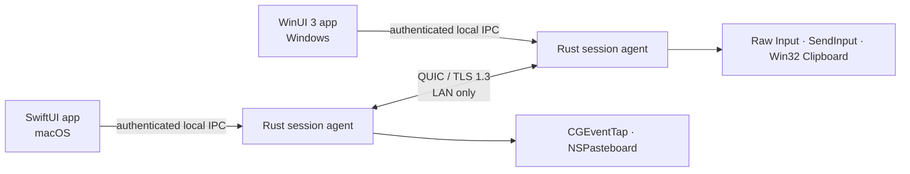

<!-- doc-id: readme; lang: en; revision: 2 -->

  
  <h1>Nodavo</h1>
  
<strong>One motion. Every machine.</strong>

  
Designing a secure, local-first, open-source software KVM for macOS and Windows.

  

    <a href="README.md">English</a> ·
    <a href="README.ru.md">Русский</a>
  

  

    
    
    
  

> [!IMPORTANT]
> Nodavo is in the planning and feasibility stage. There is no usable build yet. The repository documents the product, architecture, security model, and measurable gates that must be passed before public releases.

## Vision

Nodavo is being designed to make a Mac and a Windows PC feel like one local workspace. Move the pointer across a screen edge, keep typing on the other computer, and explicitly share clipboard content or files—without a cloud account or a remote relay.

The implementation will be written from scratch. Existing software KVM projects are used only as behavioral and interoperability references under the project's [clean-room policy](docs/clean-room-policy.md).

## Product principles

- **Local first:** direct peer-to-peer operation on a trusted local network.
- **Secure by default:** mutual authentication and encrypted transport; no plaintext mode.
- **Equal peers:** either computer can become the active input source.
- **Explicit data sharing:** separate permissions for input, clipboard, and files.
- **Native experience:** first-class macOS and Windows permission, tray, and update flows.
- **Honest open source:** documented protocol, public threat model, reproducible release evidence.

## Planned 1.0 scope

| Capability | Target | Current status |
| --- | --- | --- |
| Mouse and keyboard sharing | macOS ↔ Windows, both directions | Research |
| Seamless edge switching | Mixed DPI and multi-monitor layouts | Planned |
| Clipboard | UTF-8 text, HTML, PNG/BMP | Planned |
| Files and folders | Copy/paste, queue, resume, integrity checks | Feasibility spike first |
| Discovery | mDNS with manual IP fallback | Planned |
| Pairing | User-confirmed short code and pinned device identities | Planned |
| Transport | QUIC with TLS 1.3 | Planned |
| Platforms | macOS 13+ and Windows 10 22H2/11, x64 and ARM64 | Planned |

Screen streaming, internet relay, mobile clients, Linux support, and Windows secure-desktop control are not part of the initial 1.0 scope.

## Architecture direction

High-frequency pointer motion will use QUIC datagrams. Keys, buttons, control state, clipboard content, and files will use bounded reliable streams. Device trust will be established through user-confirmed pairing and persistent mutually authenticated identities.

Read the full [architecture](docs/architecture.md) and [security model](docs/security-model.md).

## Delivery plan

Development is split into evidence-based milestones:

1. **M0 — Feasibility:** prove input capture/injection, synthetic-event suppression, QUIC, clipboard APIs, and Finder ↔ Explorer file-drop feasibility.
2. **M1 — Foundation:** workspace, native shells, local IPC, identities, discovery, pairing, and reconnect.
3. **M2 — Input:** reliable one-way Mac → Windows and Windows → Mac control.
4. **M3 — Bidirectional KVM:** equal peers, focus lease, multi-monitor layouts, mixed DPI, sleep/reconnect safety.
5. **M4 — Clipboard:** text, HTML, images, limits, and loop prevention.
6. **M5 — Files:** files/folders, queue, resume, staging, integrity, and hostile-path defenses.
7. **M6 — Product UX:** onboarding, permissions, diagnostics, trusted devices, updates, clean uninstall.
8. **M7 — Public beta:** signed installers, 100 real device pairs, 30-day dogfood, external security review.
9. **M8 — Stable 1.0:** frozen protocol, supported hardware matrix, SBOM, provenance, rollback, and response process.

See the implementation-ready [product plan](docs/product-plan.md) and public [roadmap](docs/roadmap.md).

## Documentation

| English | Русский |
| --- | --- |
| [Documentation index](docs/README.md) | [Раздел документации](docs/README.ru.md) |
| [Product plan](docs/product-plan.md) | [План продукта](docs/product-plan.ru.md) |
| [Architecture](docs/architecture.md) | [Архитектура](docs/architecture.ru.md) |
| [Roadmap](docs/roadmap.md) | [Дорожная карта](docs/roadmap.ru.md) |
| [Security model](docs/security-model.md) | [Модель безопасности](docs/security-model.ru.md) |
| [Privacy](docs/privacy.md) | [Конфиденциальность](docs/privacy.ru.md) |
| [Clean-room policy](docs/clean-room-policy.md) | [Политика чистой реализации](docs/clean-room-policy.ru.md) |
| [Technical glossary](docs/glossary.md) | [Технический глоссарий](docs/glossary.ru.md) |

## Contributing

The most useful early contributions are review of the architecture, security assumptions, platform constraints, and feasibility gates. Coordinated M0 spike pull requests are welcome after approval in an issue; general core implementation contributions will open after M0 establishes the supported technical path.

Read [CONTRIBUTING.md](CONTRIBUTING.md), follow the [Code of Conduct](CODE_OF_CONDUCT.md), and use a bilingual issue form when reporting a problem or proposing a feature.

## License

Nodavo is licensed under [Apache License 2.0](LICENSE). The project uses a Developer Certificate of Origin sign-off instead of a copyright-assignment CLA.
