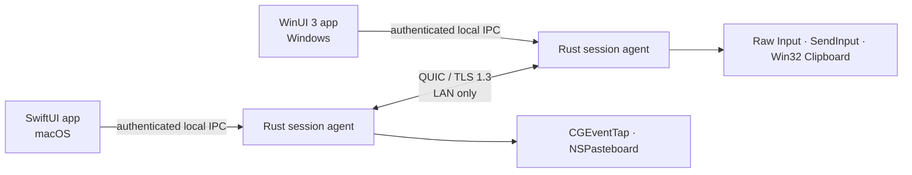

<!-- doc-id: readme; lang: en; revision: 15 -->

  
  <h1>Nodavo</h1>
  
<strong>One motion. Every machine.</strong>

  
Designing a secure, local-first, open-source software KVM for macOS and Windows.

  

    <a href="README.md">English</a> ·
    <a href="README.ru.md">Русский</a>
  

  

    
    
    
  

> [!IMPORTANT]
> Nodavo is under active pre-alpha implementation. There is no supported cross-machine build or public release yet. The integrated Rust agent, macOS shell, and WinUI 3 x64 shell compile in CI, and clearly labeled development packaging exists for macOS and Windows, but real Mac ↔ PC runtime qualification, release signing, clean installation, detailed transfer progress, and the full release test matrix are not finished.

## Vision

Nodavo is being designed to make a Mac and a Windows PC feel like one local workspace. Move the pointer across a screen edge, keep typing on the other computer, and explicitly share clipboard content or files—without a cloud account or a remote relay.

The implementation will be written from scratch. Existing software KVM projects are used only as behavioral and interoperability references under the project's [clean-room policy](docs/clean-room-policy.md).

## Product principles

- **Local first:** direct peer-to-peer operation on a trusted local network.
- **Secure by default:** mutual authentication and encrypted transport; no plaintext mode.
- **Equal peers:** either computer can become the active input source.
- **Explicit data sharing:** separate permissions for input, clipboard, and files.
- **Native experience:** first-class macOS and Windows permission, tray, and update flows.
- **Honest open source:** documented protocol, public threat model, reproducible release evidence.

## Current implementation status

| Capability | 1.0 target | Current pre-alpha status |
| --- | --- | --- |
| Mouse and keyboard sharing | macOS ↔ Windows, both directions | Both native bridges are wired to authenticated equal-peer sessions. Reliable pointer entry is acknowledged before suppression; relative motion, HID/media keys, buttons, scroll, focus leases, forced release, and lifecycle recovery pass virtual/native-inert checks. Real Mac ↔ PC hardware proof is still missing |
| Seamless edge switching | Mixed DPI and multi-monitor layouts | Authenticated session-scoped topology, mixed-DPI transforms, explicit edge routes, debounce/hysteresis, reliable entry, and relative deltas are wired. The layout editor, hot-plug refresh, and physical multi-monitor proof are missing |
| Clipboard | UTF-8 text, HTML, PNG/BMP | The reliable peer channel enforces independent grants, bounded streaming, BLAKE3, loop prevention, and cleanup. macOS supports text/HTML/PNG/clear; Windows supports text/HTML/PNG/clear and a strict BMP subset. Windows has compile/parser evidence only |
| Files and folders | Copy/paste, queue, resume, integrity checks | Authenticated manifest/data channels, bounded background workers, explicit native pickers on both shells, exact-offset same-process resume, peer-scoped revoke cleanup, BLAKE3, private no-follow staging, and no-overwrite publication pass focused/virtual checks. Detailed progress, real cross-machine proof, process-restart outbound/owner journals, and Windows power-loss directory durability are missing |
| Discovery | mDNS with manual IP fallback | The agent resolves bounded mDNS records and accepts manual addresses; automatic device-list UX is missing |
| Pairing | User-confirmed short code and pinned device identities | Pairing-time grants, signed trust, pinned mutual TLS reconnect, directional grant epochs, transactional post-pair changes, bounded trusted-device listing, and revocation work in focused tests. Both native shells expose this UX. Signed/provisioned Keychain success and real Windows runtime validation remain |
| Transport | QUIC with TLS 1.3 | Pairing, pinned reconnect, negotiation, topology, focus, reliable input, acknowledged entry, datagrams/fallback, clipboard, and bounded file channels run over one mutually authenticated connection in focused/virtual tests. Real two-device loss/reorder/performance qualification is missing |
| Updates | Signed checks, explicit consent, safe install and rollback | The agent has an unconfigured-by-default, non-activating update slice: compile-time pinned manifest endpoint and Ed25519 public key, native platform TLS, a signed manifest with same-origin artifacts, exact offer consent, resumable verified private staging on macOS, and a pollable bilingual macOS Settings flow with up-to-date and resume states. No production endpoint or signing key has been used; installation, activation, restart/rollback supervision, protected update-state persistence, and Windows staging/UI are absent |
| Platforms | macOS 13+ and Windows 10 22H2/11, x64 and ARM64 | SwiftUI and WinUI 3 x64 compile in CI; Rust checks for macOS arm64/x64 and Windows x64. Correctly signed macOS release builds now use reciprocal per-message XPC code requirements over a fixed LaunchAgent Mach service with no UDS fallback; development packaging alone compiles an explicit unsafe same-UID UDS bypass. Windows source reciprocally binds each one-request named-pipe connection to the exact packaged UI and the exact signed agent image beneath that UI package's installed root, and exposes a fixed launch action plus an opt-in StartupTask. This rejects independent endpoint impersonation but is not a separate Windows principal against invasive access to an authorized process. A universal development macOS app/DMG is reproducibly assembled, and a fail-closed Windows x64+ARM64 development MSIXBundle workflow exists. Signed mutual macOS runtime proof, live Developer ID/notarization credentials, installed Windows lifecycle/auth execution, production Authenticode, ARM64 runtime, and clean installer matrices remain unproven |

Screen streaming, internet relay, mobile clients, Linux support, and Windows secure-desktop control are not part of the initial 1.0 scope.

### What exists today

- A Rust workspace with bounded protocol, identity, transport, session, discovery, clipboard, transfer, update-verification, and local-IPC components.
- A per-user Rust agent with private local IPC, manual/mDNS pairing, explicit pairing-time grants, signed trust, pinned reconnect, revocation, negotiated peer sessions, authenticated topology, relative input, clipboard synchronization, deterministic safety recovery, and emergency stop. macOS uses Keychain by default; its file store requires an explicit insecure-development flag.
- A bilingual SwiftUI macOS menu-bar shell connected to the local agent through release signed XPC (or the explicit unsafe development UDS), including pairing, trusted-device/grant management, confirmed revocation, and explicit file/folder selection.
- A bilingual WinUI 3 shell with bounded status, emergency stop, pairing, trusted-device/grant management, confirmed revocation, explicit file/folder selection, a fixed package-root agent launch action, and opt-in login startup. Before any command, the shell verifies its own package root and the exact signed agent process/image inside it; the agent reciprocally verifies the configured packaged UI and closes after one response. Ambiguous grant/transfer outcomes reconcile or lock retries instead of claiming rollback. GitHub Actions compiles its x64 Release configuration; the installed lifecycle and mutual-authentication path has not been run interactively on Windows.
- Original macOS and Windows input/clipboard runtimes wired into the agent, with default-off suppression, injected-event rejection, bounded relative motion, lifecycle recovery, deterministic release, and content-redacted failures.
- Authenticated bounded file channels, a four-reservation process worker, cooperative scan cancellation, peer-scoped cleanup, private capability-rooted receiver staging, and an outbound filesystem source with exact hashes, mutation detection, no-follow handles, Windows birth-time DACLs, and conservative no-overwrite publication.
- A universal development macOS app/DMG pipeline and a fail-closed Developer ID/provisioning/notarization release path. Release credentials are unavailable, so only the explicitly non-distributable development artifact has been built.
- A non-activating signed-update slice in the agent and macOS Settings: when an endpoint and Ed25519 public key are explicitly embedded at compile time, the agent uses native platform TLS without redirects or decompression, verifies a bounded signed manifest and same-origin artifact, records consent for the exact offer UUID, and resumes digest-verified downloads into private capability-rooted staging with a cross-process lease, quotas, retention, and file/directory synchronization. It is unconfigured by default and has no production endpoint, private signing key, protected Keychain update journal, durable rollback floor, installer, activation, restart/rollback supervisor, or Windows staging/UI integration.

### What still blocks a usable build

- Real interactive Mac ↔ Windows validation of input, relative edge crossing, DPI, lifecycle, clipboard, DPAPI, named-pipe/WinUI flow, and recovery; Windows ARM64 evidence is also missing.
- Real peer file-transfer qualification, user-selected receive destinations, detailed progress/cancel history, durable peer/outbound ownership across agent restart, hot-plug layout editing, onboarding, diagnostics, and updater installation/activation/restart/rollback supervision, including Windows updater staging and UI.
- A signed/provisioned macOS run proving Keychain/TCC stability, plus Developer ID/notarization and Authenticode/MSIX/MSI release credentials and clean install/upgrade/uninstall matrices.
- The full security, fuzz, stress, compatibility, accessibility, long-running beta, external-review, SBOM/provenance, and real-hardware gates required for 1.0.

## Architecture direction

High-frequency pointer motion will use QUIC datagrams. Keys, buttons, control state, clipboard content, and files will use bounded reliable streams. Device trust will be established through user-confirmed pairing and persistent mutually authenticated identities.

Read the full [architecture](docs/architecture.md) and [security model](docs/security-model.md).

## Delivery plan

Development is split into evidence-based milestones. M0/M1 foundations are now being implemented, but no milestone is claimed complete until its exit gates pass:

1. **M0 — Feasibility:** prove input capture/injection, synthetic-event suppression, QUIC, clipboard APIs, and Finder ↔ Explorer file-drop feasibility.
2. **M1 — Foundation:** workspace, native shells, local IPC, identities, discovery, pairing, and reconnect.
3. **M2 — Input:** reliable one-way Mac → Windows and Windows → Mac control.
4. **M3 — Bidirectional KVM:** equal peers, focus lease, multi-monitor layouts, mixed DPI, sleep/reconnect safety.
5. **M4 — Clipboard:** text, HTML, images, limits, and loop prevention.
6. **M5 — Files:** files/folders, queue, resume, staging, integrity, and hostile-path defenses.
7. **M6 — Product UX:** onboarding, permissions, diagnostics, trusted devices, updates, clean uninstall.
8. **M7 — Public beta:** signed installers, 100 real device pairs, 30-day dogfood, external security review.
9. **M8 — Stable 1.0:** frozen protocol, supported hardware matrix, SBOM, provenance, rollback, and response process.

See the implementation-ready [product plan](docs/product-plan.md) and public [roadmap](docs/roadmap.md).

## Documentation

| English | Русский |
| --- | --- |
| [Documentation index](docs/README.md) | [Раздел документации](docs/README.ru.md) |
| [Product plan](docs/product-plan.md) | [План продукта](docs/product-plan.ru.md) |
| [Architecture](docs/architecture.md) | [Архитектура](docs/architecture.ru.md) |
| [Peer protocol](docs/protocol.md) | [Протокол между устройствами](docs/protocol.ru.md) |
| [Roadmap](docs/roadmap.md) | [Дорожная карта](docs/roadmap.ru.md) |
| [Security model](docs/security-model.md) | [Модель безопасности](docs/security-model.ru.md) |
| [Privacy](docs/privacy.md) | [Конфиденциальность](docs/privacy.ru.md) |
| [Clean-room policy](docs/clean-room-policy.md) | [Политика чистой реализации](docs/clean-room-policy.ru.md) |
| [Technical glossary](docs/glossary.md) | [Технический глоссарий](docs/glossary.ru.md) |

## Contributing

The most useful contributions are focused implementation or review of an existing milestone, security assumptions, platform constraints, and feasibility gates. Coordinate substantial work in an issue first, preserve the documented trust boundaries, and never describe a compiling component as a released feature.

Read [CONTRIBUTING.md](CONTRIBUTING.md), follow the [Code of Conduct](CODE_OF_CONDUCT.md), and use a bilingual issue form when reporting a problem or proposing a feature.

## License

Nodavo is licensed under [Apache License 2.0](LICENSE). The project uses a Developer Certificate of Origin sign-off instead of a copyright-assignment CLA.
