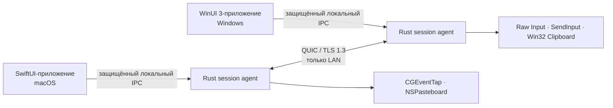

<!-- doc-id: readme; lang: ru; translation-of: README.md; revision: 9 -->

  
  <h1>Nodavo</h1>
  
<strong>Одно движение. Все компьютеры.</strong>

  
Проект безопасного локального программного KVM с открытым исходным кодом для macOS и Windows.

  

    <a href="README.md">English</a> ·
    <a href="README.ru.md">Русский</a>
  

  

    
    
    
  

> [!IMPORTANT]
> Nodavo находится в активной разработке на стадии pre-alpha. Рабочей межкомпьютерной сборки и публичного релиза пока нет. Rust workspace и оболочка macOS компилируются для разработки, но исходники WinUI ещё не собирались на Windows, а полный путь macOS ↔ Windows, установщики и релизная проверка не готовы.

## Видение

Nodavo создаётся, чтобы Mac и Windows-компьютер ощущались как одно локальное рабочее пространство. Курсор переходит через край экрана, клавиатура продолжает работать на другом компьютере, а содержимое буфера и файлы передаются только с явного разрешения — без облачной учётной записи и сервера-посредника.

Реализация будет написана с нуля. Существующие программные KVM используются только как ориентиры поведения и совместимости в рамках [политики чистой реализации](docs/clean-room-policy.ru.md).

## Принципы продукта

- **Локальная работа:** прямое соединение между устройствами в доверенной локальной сети.
- **Безопасность по умолчанию:** взаимная аутентификация и шифрование; незашифрованного режима нет.
- **Равноправные устройства:** любой компьютер может стать источником ввода.
- **Явная передача данных:** отдельные разрешения для ввода, буфера и файлов.
- **Нативный интерфейс:** полноценные сценарии разрешений, строки меню, системного трея и обновлений для macOS и Windows.
- **Честный открытый код:** документированный протокол, публичная модель угроз и воспроизводимые доказательства качества релизов.

## Текущее состояние реализации

| Возможность | Цель для 1.0 | Текущий статус pre-alpha |
| --- | --- | --- |
| Общая мышь и клавиатура | macOS ↔ Windows в обе стороны | Компилируются аутентифицированные двусторонние каналы сессии, focus leases, forced release, подключённый macOS capture/injection bridge и оба нативных runtime; нет Windows agent bridge и реального hardware-доказательства Mac ↔ PC |
| Переход через край экрана | Разный масштаб DPI и несколько мониторов | Двустороннее переключение focus в том же соединении и renewal lease проходят virtual proof; в macOS есть ручное управление, но нет edge detection, authenticated display topology, mixed-DPI routing и редактора |
| Буфер обмена | UTF-8 текст, HTML, PNG/BMP | Есть ограниченные контракты синхронизации и Windows-граница буфера; нет production-адаптера macOS и синхронизации между устройствами |
| Файлы и папки | Копирование, очередь, возобновление, проверка целостности | Есть ограниченная FIFO-очередь и файловый staging; staging проверяет BLAKE3 каждого файла, возобновляет с точного offset, отбрасывает torn tail и завершает без перезаписи; нет peer-интеграции |
| Обнаружение | mDNS и запасной вариант с ручным IP | Агент разрешает ограниченные записи mDNS и принимает ручные адреса; автоматического списка устройств в интерфейсе пока нет |
| Сопряжение | Подтверждаемый пользователем короткий код и закреплённые идентификаторы устройств | Два агента могут привязать явные отдельные разрешения к одному коду, сохранить подписанное доверие, переподключиться с взаимно закреплённым TLS и отвергнуть отозванное устройство; оба нативных сценария есть в исходниках, но отсутствуют Windows runtime-проверка и изменение разрешений после сопряжения |
| Транспорт | QUIC с TLS 1.3 | Через QUIC/TLS 1.3 работают реальное сопряжение, безопасное переподключение, negotiation, control, reliable input, datagrams и pointer fallback; peer-каналы буфера и файлов ещё не подключены |
| Платформы | macOS 13+ и Windows 10 22H2/11, x64 и ARM64 | SwiftUI-оболочка macOS компилируется; исходники Windows Rust-агента cross-check для x64 с приватным named-pipe IPC и DPAPI-хранилищем, а двуязычный сценарий WinUI 3 проходит проверки XML/исходников, но runtime-доказательств Windows пока нет |

Трансляция экрана, сервер-посредник в интернете, мобильные клиенты, Linux и управление Windows Secure Desktop не входят в первоначальный объём 1.0.

### Что уже существует

- Rust workspace с ограниченными компонентами протокола, идентификаторов, транспорта, сессии, обнаружения, буфера, передачи файлов, проверки обновлений и локального IPC.
- Пользовательский Rust-агент с приватным локальным IPC, ручным/mDNS-сопряжением, явными разрешениями, подписанным доверием, закреплённым reconnect, отзывом, negotiation peer session, focus leases, bounded input channels, детерминированным safety recovery и emergency stop. Файловое хранилище macOS предназначено только для разработки.
- Двуязычная SwiftUI-оболочка macOS в строке меню, подключённая к приватному локальному сокету агента, включая ручной/ожидающий режим сопряжения и явное подтверждение кода.
- Исходники двуязычной WinUI 3-оболочки с ограниченными запросами статуса, аварийного отключения, ручного/ожидающего сопряжения и явного подтверждения кода через named pipe. Она ещё не компилировалась и не запускалась на Windows.
- Оригинальные owned input runtimes macOS/Windows с default-off suppression, отклонением synthetic events, lifecycle recovery, injection acknowledgements и display boundaries; macOS подключён к агенту, Windows agent bridge ещё отсутствует. Также есть clipboard, Keychain, DPAPI и protected pipe boundaries.
- Ограниченная детерминированная transfer queue и приватный файловый staging с проверкой путей/размеров, durable-журналом offset, возобновлением, BLAKE3 и запретом перезаписи назначения.
- Определение CI только для компиляционных проверок и небольшие программы проверки реализуемости. Это инфраструктура разработчика, а не распространяемое приложение.

### Чего не хватает до рабочей сборки

- Подключить Windows native input runtime, буфер и transfers к аутентифицированной peer session; добавить edge switching и authenticated mapping дисплеев; затем доказать реальный путь Mac ↔ PC.
- Успешная Windows-проверка сборки/запуска интегрированных агента, DPAPI-хранилища, named pipe и WinUI, а также полные сценарии первоначальной настройки, разрешений, раскладки, диагностики и восстановления на обеих платформах.
- Интеграция реализованной границы macOS Keychain как production-хранилища агента и provisioned access-group entitlement; peer orchestration очереди буфера/файлов, очистка устаревшего состояния и установка обновлений.
- Подписанные установщики и полная программа проверок безопасности, фаззинга, нагрузки, совместимости, доступности, обновлений и реального оборудования для 1.0.

## Направление архитектуры

Частые движения указателя пойдут через датаграммы QUIC. Клавиши, кнопки, управляющее состояние, буфер и файлы будут передаваться через ограниченные надёжные потоки. Доверие создаётся подтверждаемым пользователем сопряжением и постоянными взаимно проверяемыми идентификаторами устройств.

Подробности находятся в документах [«Архитектура»](docs/architecture.ru.md) и [«Модель безопасности»](docs/security-model.ru.md).

## План разработки

Разработка разделена на этапы с проверяемыми условиями выхода. Основа M0/M1 уже реализуется, но ни один этап не считается завершённым до прохождения его выходных критериев:

1. **M0 — Реализуемость:** доказать захват и эмуляцию ввода, подавление синтетических событий, QUIC, API буфера и возможность переноса файлов Finder ↔ Explorer.
2. **M1 — Основа:** рабочее пространство, нативные оболочки, локальный IPC, идентификаторы, обнаружение, сопряжение и переподключение.
3. **M2 — Ввод:** надёжное одностороннее управление Mac → Windows и Windows → Mac.
4. **M3 — Двусторонний KVM:** равноправные устройства, аренда фокуса, несколько мониторов, разный DPI, безопасные сон и переподключение.
5. **M4 — Буфер:** текст, HTML, изображения, лимиты и защита от циклов.
6. **M5 — Файлы:** файлы и папки, очередь, возобновление, промежуточное хранение, целостность и защита путей.
7. **M6 — Интерфейс продукта:** первоначальная настройка, разрешения, диагностика, доверенные устройства, обновления и чистое удаление.
8. **M7 — Публичная бета:** подписанные установщики, 100 реальных пар устройств, 30 дней внутреннего использования и внешний аудит безопасности.
9. **M8 — Стабильная 1.0:** стабильный протокол, подтверждённая матрица оборудования, SBOM, происхождение сборок, откат и процесс реакции на уязвимости.

Смотрите подробный [план продукта](docs/product-plan.ru.md) и публичную [дорожную карту](docs/roadmap.ru.md).

## Документация

| English | Русский |
| --- | --- |
| [Documentation index](docs/README.md) | [Раздел документации](docs/README.ru.md) |
| [Product plan](docs/product-plan.md) | [План продукта](docs/product-plan.ru.md) |
| [Architecture](docs/architecture.md) | [Архитектура](docs/architecture.ru.md) |
| [Peer protocol](docs/protocol.md) | [Протокол между устройствами](docs/protocol.ru.md) |
| [Roadmap](docs/roadmap.md) | [Дорожная карта](docs/roadmap.ru.md) |
| [Security model](docs/security-model.md) | [Модель безопасности](docs/security-model.ru.md) |
| [Privacy](docs/privacy.md) | [Конфиденциальность](docs/privacy.ru.md) |
| [Clean-room policy](docs/clean-room-policy.md) | [Политика чистой реализации](docs/clean-room-policy.ru.md) |
| [Technical glossary](docs/glossary.md) | [Технический глоссарий](docs/glossary.ru.md) |

## Участие в разработке

Сейчас особенно полезны целевые реализации или рецензии существующего этапа, предположений безопасности, платформенных ограничений и критериев реализуемости. Сначала согласуйте значительную работу в issue, сохраняйте задокументированные границы доверия и не называйте компилируемый компонент выпущенной функцией.

Прочитайте [CONTRIBUTING.ru.md](CONTRIBUTING.ru.md), соблюдайте [Кодекс поведения](CODE_OF_CONDUCT.ru.md) и используйте двуязычные формы issues.

## Лицензия

Nodavo распространяется по [Apache License 2.0](LICENSE). Вместо CLA с передачей авторских прав проект использует подтверждение Developer Certificate of Origin.
