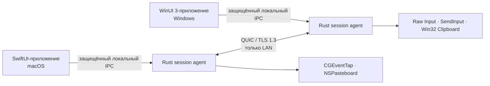

<!-- doc-id: readme; lang: ru; translation-of: README.md; revision: 10 -->

  
  <h1>Nodavo</h1>
  
<strong>Одно движение. Все компьютеры.</strong>

  
Проект безопасного локального программного KVM с открытым исходным кодом для macOS и Windows.

  

    <a href="README.md">English</a> ·
    <a href="README.ru.md">Русский</a>
  

  

    
    
    
  

> [!IMPORTANT]
> Nodavo находится в активной разработке на стадии pre-alpha. Поддерживаемой межкомпьютерной сборки и публичного релиза пока нет. Интегрированный Rust-агент, оболочка macOS и WinUI 3 x64 компилируются в CI, а репозиторий собирает явно помеченные development app/DMG для macOS, но реальная квалификация Mac ↔ PC, release signing, установщики и полный файловый/product UX ещё не готовы.

## Видение

Nodavo создаётся, чтобы Mac и Windows-компьютер ощущались как одно локальное рабочее пространство. Курсор переходит через край экрана, клавиатура продолжает работать на другом компьютере, а содержимое буфера и файлы передаются только с явного разрешения — без облачной учётной записи и сервера-посредника.

Реализация будет написана с нуля. Существующие программные KVM используются только как ориентиры поведения и совместимости в рамках [политики чистой реализации](docs/clean-room-policy.ru.md).

## Принципы продукта

- **Локальная работа:** прямое соединение между устройствами в доверенной локальной сети.
- **Безопасность по умолчанию:** взаимная аутентификация и шифрование; незашифрованного режима нет.
- **Равноправные устройства:** любой компьютер может стать источником ввода.
- **Явная передача данных:** отдельные разрешения для ввода, буфера и файлов.
- **Нативный интерфейс:** полноценные сценарии разрешений, строки меню, системного трея и обновлений для macOS и Windows.
- **Честный открытый код:** документированный протокол, публичная модель угроз и воспроизводимые доказательства качества релизов.

## Текущее состояние реализации

| Возможность | Цель для 1.0 | Текущий статус pre-alpha |
| --- | --- | --- |
| Общая мышь и клавиатура | macOS ↔ Windows в обе стороны | Оба native bridge подключены к аутентифицированным equal-peer sessions. Reliable pointer entry подтверждается до suppression; relative motion, HID/media keys, buttons, scroll, focus leases, forced release и lifecycle recovery проходят virtual/native-inert проверки. Реального hardware-доказательства Mac ↔ PC пока нет |
| Переход через край экрана | Разный масштаб DPI и несколько мониторов | Подключены authenticated session-scoped topology, mixed-DPI transforms, явные edge routes, debounce/hysteresis, reliable entry и relative deltas. Нет layout editor, hot-plug refresh и физической multi-monitor проверки |
| Буфер обмена | UTF-8 текст, HTML, PNG/BMP | Надёжный peer channel применяет независимые grants, bounded streaming, BLAKE3, loop prevention и cleanup. macOS поддерживает text/HTML/PNG/clear; Windows — text/HTML/PNG/clear и строгий subset BMP. Для Windows есть только compile/parser evidence |
| Файлы и папки | Копирование, очередь, возобновление, проверка целостности | Есть безопасный receive staging, durable exact-offset resume, очередь и no-overwrite finalization. Capability-rooted outbound source отклоняет links/reparse points, sparse/special files, mutation, collisions и unsafe resume. Peer channels и native transfer UI ещё не подключены |
| Обнаружение | mDNS и запасной вариант с ручным IP | Агент разрешает ограниченные записи mDNS и принимает ручные адреса; автоматического списка устройств в интерфейсе пока нет |
| Сопряжение | Подтверждаемый пользователем короткий код и закреплённые идентификаторы устройств | Pairing-time grants, signed trust, pinned mutual TLS reconnect и revocation работают в smoke tests агентов. macOS по умолчанию использует Keychain, Windows — DPAPI; остаются signed/provisioned Keychain success, Windows runtime, trusted-device UI и post-pair изменения grants |
| Транспорт | QUIC с TLS 1.3 | Через одно mutually authenticated соединение работают pairing, pinned reconnect, negotiation, topology, focus, reliable input, acknowledged entry, datagrams/fallback и clipboard. File peer channels ещё не подключены |
| Платформы | macOS 13+ и Windows 10 22H2/11, x64 и ARM64 | SwiftUI и WinUI 3 x64 компилируются в CI; Rust проверяется для macOS arm64/x64 и Windows x64, также собирается universal development app/DMG macOS. Windows runtime/ARM64, Developer ID/notarization и release installers не доказаны |

Трансляция экрана, сервер-посредник в интернете, мобильные клиенты, Linux и управление Windows Secure Desktop не входят в первоначальный объём 1.0.

### Что уже существует

- Rust workspace с ограниченными компонентами протокола, идентификаторов, транспорта, сессии, обнаружения, буфера, передачи файлов, проверки обновлений и локального IPC.
- Пользовательский Rust-агент с приватным локальным IPC, ручным/mDNS-сопряжением, явными grants, signed trust, pinned reconnect, revocation, negotiated peer sessions, authenticated topology, relative input, clipboard sync, deterministic safety recovery и emergency stop. macOS по умолчанию использует Keychain; файловое хранилище включается только явным insecure-development flag.
- Двуязычная SwiftUI-оболочка macOS в строке меню, подключённая к приватному локальному сокету агента, включая ручной/ожидающий режим сопряжения и явное подтверждение кода.
- Двуязычная WinUI 3-оболочка с ограниченными статусом, emergency stop, manual/listening pairing и подтверждением кода через protected named pipe. GitHub Actions компилирует Release x64; интерактивного запуска Windows пока не было.
- Оригинальные macOS/Windows input и clipboard runtimes, подключённые к agent, с default-off suppression, injected-event rejection, bounded relative motion, lifecycle recovery, deterministic release и content-redacted failures.
- Ограниченная transfer queue, durable private receiver staging и capability-rooted outbound filesystem source с exact hashes, resume evidence, mutation detection и no-follow paths. Network/file-selection orchestration ещё отсутствует.
- Universal development app/DMG pipeline для macOS и fail-closed release path Developer ID/provisioning/notarization. Release credentials недоступны, поэтому собран только явно непригодный для распространения development artifact.

### Чего не хватает до рабочей сборки

- Реальная интерактивная Mac ↔ Windows проверка input, relative edge crossing, DPI, lifecycle, clipboard, DPAPI, named-pipe/WinUI flow и recovery; также отсутствует Windows ARM64 evidence.
- File manifest/data channel orchestration, выбранные пользователем destinations, transfer queue UI, trusted-device и post-pair permission management, hot-plug layout editor, onboarding, diagnostics и updater installation.
- Signed/provisioned запуск macOS, подтверждающий стабильность Keychain/TCC, а также Developer ID/notarization и Authenticode/MSIX/MSI credentials с clean install/upgrade/uninstall matrices.
- Полные security, fuzz, stress, compatibility, accessibility, long-running beta, external-review, SBOM/provenance и real-hardware gates версии 1.0.

## Направление архитектуры

Частые движения указателя пойдут через датаграммы QUIC. Клавиши, кнопки, управляющее состояние, буфер и файлы будут передаваться через ограниченные надёжные потоки. Доверие создаётся подтверждаемым пользователем сопряжением и постоянными взаимно проверяемыми идентификаторами устройств.

Подробности находятся в документах [«Архитектура»](docs/architecture.ru.md) и [«Модель безопасности»](docs/security-model.ru.md).

## План разработки

Разработка разделена на этапы с проверяемыми условиями выхода. Основа M0/M1 уже реализуется, но ни один этап не считается завершённым до прохождения его выходных критериев:

1. **M0 — Реализуемость:** доказать захват и эмуляцию ввода, подавление синтетических событий, QUIC, API буфера и возможность переноса файлов Finder ↔ Explorer.
2. **M1 — Основа:** рабочее пространство, нативные оболочки, локальный IPC, идентификаторы, обнаружение, сопряжение и переподключение.
3. **M2 — Ввод:** надёжное одностороннее управление Mac → Windows и Windows → Mac.
4. **M3 — Двусторонний KVM:** равноправные устройства, аренда фокуса, несколько мониторов, разный DPI, безопасные сон и переподключение.
5. **M4 — Буфер:** текст, HTML, изображения, лимиты и защита от циклов.
6. **M5 — Файлы:** файлы и папки, очередь, возобновление, промежуточное хранение, целостность и защита путей.
7. **M6 — Интерфейс продукта:** первоначальная настройка, разрешения, диагностика, доверенные устройства, обновления и чистое удаление.
8. **M7 — Публичная бета:** подписанные установщики, 100 реальных пар устройств, 30 дней внутреннего использования и внешний аудит безопасности.
9. **M8 — Стабильная 1.0:** стабильный протокол, подтверждённая матрица оборудования, SBOM, происхождение сборок, откат и процесс реакции на уязвимости.

Смотрите подробный [план продукта](docs/product-plan.ru.md) и публичную [дорожную карту](docs/roadmap.ru.md).

## Документация

| English | Русский |
| --- | --- |
| [Documentation index](docs/README.md) | [Раздел документации](docs/README.ru.md) |
| [Product plan](docs/product-plan.md) | [План продукта](docs/product-plan.ru.md) |
| [Architecture](docs/architecture.md) | [Архитектура](docs/architecture.ru.md) |
| [Peer protocol](docs/protocol.md) | [Протокол между устройствами](docs/protocol.ru.md) |
| [Roadmap](docs/roadmap.md) | [Дорожная карта](docs/roadmap.ru.md) |
| [Security model](docs/security-model.md) | [Модель безопасности](docs/security-model.ru.md) |
| [Privacy](docs/privacy.md) | [Конфиденциальность](docs/privacy.ru.md) |
| [Clean-room policy](docs/clean-room-policy.md) | [Политика чистой реализации](docs/clean-room-policy.ru.md) |
| [Technical glossary](docs/glossary.md) | [Технический глоссарий](docs/glossary.ru.md) |

## Участие в разработке

Сейчас особенно полезны целевые реализации или рецензии существующего этапа, предположений безопасности, платформенных ограничений и критериев реализуемости. Сначала согласуйте значительную работу в issue, сохраняйте задокументированные границы доверия и не называйте компилируемый компонент выпущенной функцией.

Прочитайте [CONTRIBUTING.ru.md](CONTRIBUTING.ru.md), соблюдайте [Кодекс поведения](CODE_OF_CONDUCT.ru.md) и используйте двуязычные формы issues.

## Лицензия

Nodavo распространяется по [Apache License 2.0](LICENSE). Вместо CLA с передачей авторских прав проект использует подтверждение Developer Certificate of Origin.
