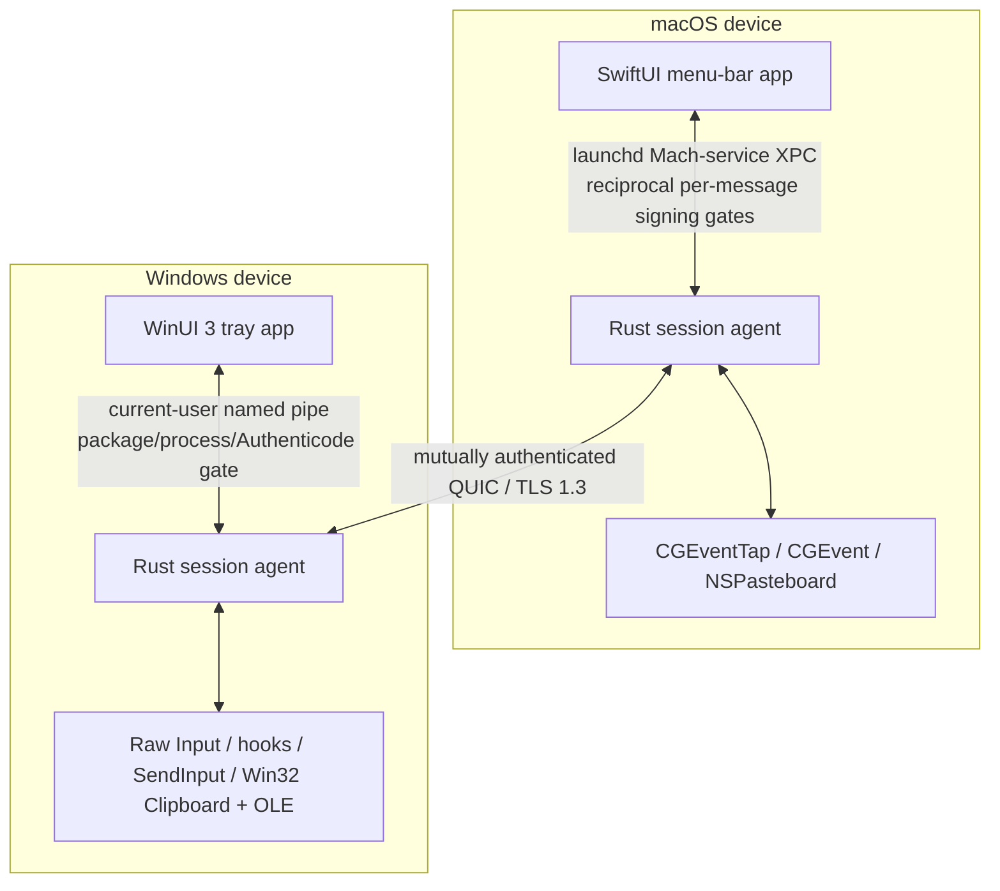

<!-- doc-id: architecture; lang: en; revision: 14 -->

# Architecture

[English](architecture.md) · [Русский](architecture.ru.md)

This document defines the intended architecture. It becomes binding only through implemented ADRs and tested code.

## System boundaries

Each device runs a native UI and an unprivileged Rust session agent. The UI owns user interaction and OS permission guidance. The agent owns network identity, pairing, session state, transport, input routing, clipboard, and transfers.

No hosted control plane, account service, relay, or telemetry collector is required for normal operation.

## Planned Rust workspace

| Crate | Responsibility |
| --- | --- |
| `nodavo-protocol` | Versioned messages, limits, capabilities, error model, golden vectors |
| `nodavo-transport` | QUIC, streams, datagrams, reconnect, deadlines, backpressure |
| `nodavo-identity` | Ed25519 device identity, pairing, pinning, grants, revocation |
| `nodavo-discovery` | mDNS advertisement/browse and manual address fallback |
| `nodavo-session` | Peer lifecycle, focus ownership lease, switching and recovery |
| `nodavo-input` | Canonical HID events, mappings, coordinate and modifier state |
| `nodavo-clipboard` | Text/HTML/image normalization, versioning, ownership and limits |
| `nodavo-transfer` | Manifests, chunks, staging, BLAKE3, resume, quota and finalize |
| `nodavo-platform-macos` | Capture, injection, permissions, displays, pasteboard, Keychain, signed local-IPC policy, and validation-only sealed update bundles |
| `nodavo-platform-windows` | Capture, injection, sessions, displays, clipboard, OLE, private update staging, and read-only Appx inspection |
| `nodavo-local-ipc` | Authenticated UI ↔ agent protocol and OS access controls |
| `nodavo-agent` | Process orchestration and lifecycle |
| `nodavo-update` | Signed manifests, verification, staging contracts, an encode-only one-shot handoff for ordinary callers, and a feature-gated external-supervisor reducer |

Crates use dependency injection at platform and transport boundaries. Tests can replace both with deterministic virtual adapters.

Update activation is intentionally outside the running UI and agent. After verified staging and a distinct **Install and restart** decision, consuming the exact `ReadyToInstall` session is the only ordinary API that produces a handoff. Its fixed bounded codec carries only a nonzero one-shot request ID and the exact original signed manifest envelope; it cannot carry a caller-selected path, plan, artifact name, transaction, attempt, phase, or action. The default agent build can encode that opaque request but excludes handoff decoding and all supervisor host, admission, reducer, and action APIs. Repository CI and macOS/Windows packaging gates reject the non-default `supervisor-host` feature from agent artifacts. This is a packaging/build trust boundary only; a real supervisor must still mutually authenticate the process and current installation, hold an exclusive protected transaction, and authenticate persistent state.

With `supervisor-host`, initial admission provisionally reserves the request without durably consuming it, then authenticates the exact current target/version, loads a fresh rollback floor, authoritatively re-verifies the original signed envelope, derives the plan locally, and reopens and rehashes the exact sealed content-addressed artifact. Supervisor-generated transaction and old-process-attempt identities are stored with the request ID in journal schema 3. The request tombstone, exact old-process binding, and journal must be committed atomically and reloaded through the authenticated store before reducer execution. Once persistence is called, an error or non-exact reload is commit-ambiguous: admission and the lock remain closed, and only authenticated-store recovery may establish whether any retry or action is allowed.

The source-only reducer then authorizes one already-durable external effect at a time and binds exact candidate, predecessor, process-attempt, timeout, health, and rollback-floor evidence. Platform crates currently stop at validation/staging boundaries: macOS retains a sealed signed universal tree but exposes no replacement primitive, and Windows stages privately and inspects Appx content without deployment. A separately packaged supervisor executable, authenticated supervisor IPC, protected persistent stores, activation adapters, restart/health/rollback process wiring, and physical power-loss qualification do not yet exist.

## Transport model

One authenticated QUIC connection carries independent channels:

- **Control stream:** protocol negotiation, capabilities, focus lease, display graph, liveness and errors.
- **Reliable input stream:** key/button down/up, critical modifier state and forced release.
- **Datagrams:** pointer motion and high-frequency scrolling with sequence numbers and latest-wins behavior.
- **Clipboard streams:** one bounded stream per clipboard revision and MIME representation.
- **File streams:** manifest control plus one unidirectional stream per file.

When QUIC datagrams are unavailable, pointer motion falls back to a short-lived reliable stream without changing security.

## Input model

- Physical keys use HID Usage IDs plus modifier state.
- Text/Unicode fallback handles layout-sensitive entry and future IME support.
- Pointer coordinates are normalized per display and transformed using the destination display scale.
- Every event includes session, origin, sequence, and capability context.
- Every input event also includes the active nonzero focus-lease identifier. Control, reliable input, and replaceable input have independent sequence lanes so datagram overtaking cannot invalidate a key release.
- Injected events are tagged or suppressed so they cannot re-enter capture.
- A single focus ownership lease prevents simultaneous routing loops.
- Capture suppression is off by default and can turn on only while forwarding under that lease. Ordinary focus return keeps the authenticated connection ready for reverse-direction control.

On disconnect, timeout, lock, sleep, crash, or emergency stop, both sides release all tracked keys/buttons and restore local cursor ownership.

Display hot-plug is a session transaction rather than an in-place geometry edit. Platform callbacks only mark a coalesced dirty generation. The session owner closes routing admission, drains already admitted input under the old lease, returns focus locally, validates a stable bounded full graph with fresh process-local identities, replaces the active-only native/session map, and publishes a new topology revision. New focus is unavailable until the exact revision is acknowledged. Repeated changes retain only the latest candidate and cannot extend the fixed refresh deadline; safety, revoke, and disconnect remain higher-priority transitions.

Each trust record stores one semantic peer placement: disabled, left, right, above, or below. It never stores native or session display identifiers. After both current topologies are committed, the peer input grant is active, and every local revision directionally published for inbound control is exactly acknowledged, the session derives at most 32 deterministic exterior `Stretch` routes from that placement. An outbound-only local graph is intentionally not published and needs only the same stable committed snapshot. A topology transition, grant removal, or placement change clears derived routes; focus recovery and local-ownership restoration clear the active route and pending pointer entry. A placement mutation is persisted first; if focus is not local, the session restores ownership and disconnects before the UI reconciles the authoritative saved value. The native shells send a mutation once and use trusted-peer listing, not a resend, after an ambiguous acknowledgement.

macOS capture and injection share one immutable process snapshot sourced from CoreGraphics. Windows capture and injection share one process-singleton display service with per-monitor-v2 awareness, DisplayConfig identities, an early broadcast wake, and authoritative polling. Both platforms bind suppression to a callback/admission barrier so an input cannot be accepted remotely after being returned to the local OS. Timed-out native owners poison restart within that process instead of permitting overlapping capture, hooks, or injectors.

## Discovery and pairing

1. mDNS publishes a minimal, non-sensitive service record.
2. A bounded unauthenticated TCP preflight exchanges only short-lived ephemeral certificate metadata at that location.
3. Each side pins the exact metadata before establishing a temporary TLS 1.3 QUIC pairing session.
4. Both UIs display the same short authentication string, bound to the TLS exporter and complete role-ordered persistent trust transcript.
5. The user confirms the match on both devices.
6. Devices exchange persistent public identities and explicit capability grants.
7. Future sessions require mutual proof of the pinned identities.

Private keys are stored in macOS Keychain and Windows DPAPI/CNG-backed storage. Discovery metadata is never accepted as identity proof.

## Clipboard and files

Clipboard synchronization is revisioned and content-addressed to prevent loops. Content is transferred only when its capability is enabled. Planned types are UTF-8 text, HTML, PNG/BMP, and file lists.

Files are written to a private staging directory, bounded by quotas, validated against traversal and unsafe links, and hashed with BLAKE3. A bounded durable progress journal records only exact contiguous offsets; restart resume requires the same authenticated manifest and truncates any non-durable tail. Final publication refuses existing destinations. Received content is never auto-opened.

Release builds publish into the fixed per-user `Downloads/Nodavo` destination. The platform adapter resolves Downloads through the OS known-folder API, walks or validates the namespace without following reparse points, creates the exact private leaf, and hands the agent only an already-open directory handle. The global transfer store retains that capability for sessions and offline cleanup; each authenticated peer still receives a separate private staging namespace below it, so staging and final publication stay on one filesystem. Initial pairing and a disabled-to-enabled Files grant preflight this root before persistent authority changes. An input-only session uses an inert receive backend and never resolves Downloads. Enabling Files during an active session persists the grant and then reconnects that exact peer so an already-created inert backend cannot be upgraded in place.

Transfer execution and public presentation have separate owners. A short-held process registry admits at most 128 nonterminal rows and retains at most 32 terminal rows; it assigns a random local UUID that never appears on the peer protocol and never exposes the wire transfer UUID. The public snapshot contains only direction, phase, bounded byte counters, cancellability, and a fixed failure category. Outbound bytes advance after the reliable frame is accepted, inbound bytes after a durable staging write, and completion only after durable publication and the required authenticated acknowledgement. Targeted cancellation is linearized against finalization and reports `cancelled` only after local cleanup succeeds.

Each authenticated peer opens a private no-follow staging namespace derived from its persistent device identity. A second peer cannot resume or discard the same wire UUID, and legacy unscoped pre-alpha staging is not migrated. Process-lifetime completed and cancelled tombstones prevent reconnect reannouncement from creating a new public transfer. Identity retention is itself bounded: the registry accepts at most 4,096 lifetime generations and the peer/direction/wire ledger at most 8,192 entries. Exact retained replays remain idempotent at capacity, while a novel identity fails closed before mutation; identities are never silently evicted or reused. Selected outbound sources and public history are still process-lifetime state; durable source/history restoration across an agent restart remains a release gate.

Finder ↔ Explorer drag/drop is an M0 research gate. If native drag APIs cannot be made reliable and safe, 1.0 will expose an explicit transfer queue rather than simulate misleading drag/drop.

## Process privilege

The default 1.0 agent runs in the user session. A privileged Windows service is excluded because login/UAC secure-desktop control would significantly increase the attack surface. Any future privileged component requires a separate threat model and capability boundary.

## Local readiness projection

The agent exposes one bounded, content-free readiness snapshot through the authenticated UI protocol. Local input, local display discovery, and authenticated peer-topology synchronization are separate signals: an available display never implies that a peer layout is ready. Peer topology is `synchronizing` from connection establishment until the exact remote topology is installed and either the local revision published for inbound control is exactly acknowledged or the local graph remains intentionally unpublished because no inbound input grant exists; every teardown and recovery returns it to `not_connected`.

Platform probes run outside the async dispatcher behind a finite deadline and a short cache. They check only trust/default-desktop state, display discovery, API capability, and construction of a non-posting injector prerequisite; they never create or register a capture runtime, route, suppress, or inject input. Consequently `ready` means that local prerequisites are currently available, not that live capture has been exercised. On macOS the explicit permission action asks for Accessibility in the agent identity, ignores the prompt API's return value, and immediately rechecks actual trust. Windows exposes no Accessibility action and reports a non-default or secure input desktop only as blocked; it never offers elevation or secure-desktop control. The public snapshot contains no paths, process IDs, native display IDs, desktop names, peer identifiers, or permission-prompt metadata.

## Local process trust

The macOS release path uses the per-user launchd Mach service `dev.nodavo.agent.ipc`. Before activation, the agent configures its listener and every accepted connection with the exact UI code-signing requirement; the Swift UI configures the reciprocal exact agent requirement before activating its client. XPC checks every received message. Both requirements bind the Developer ID chain, compile-time Team ID, exact identifiers and application/team entitlements, and absent `get-task-allow`. One-value XPC dictionaries carry the existing deny-unknown bounded JSON contract into the shared exhaustive agent dispatcher.

The former UDS audit-token design was withdrawn because current `LOCAL_PEERTOKEN` task identity cannot identify bytes queued before an exec. Development packaging deliberately retains that private same-UID UDS only behind a non-default feature and labels the artifact unsafe/non-distributable; it does not advertise the release Mach service. Release has no UDS fallback or environment path override. Reciprocal enforcement is implemented in source, while live production signing/notarization and installed mutual runtime evidence remain open release gates. Payload and process metadata are not logged.

On Windows, each current-user named-pipe connection carries exactly one request and response. The server retains connection-bound pipe, process, token, and executable handles for the exact packaged UI. Before sending, the UI authenticates its own compile-time package/PFN/AUMID and installed content root, then retains the server process, token, exact non-reparse agent executable beneath that root, and pinned Authenticode evidence. Both directions verify session/logon lineage and process/token stability before consuming the authenticated result. The separately launched Rust agent is not claimed to carry package identity; its exact installed path and signature are the reciprocal trust anchor. Development and release UI package identities are separate compile-time policies; unpackaged or unconfigured peers fail closed, and packaging signs and verifies both executables. Source and cross-target checks cover the policy, but installed-MSIX behavior, production publisher/signing/timestamp credentials, and real x64/ARM64 execution remain release gates. This boundary rejects an independent endpoint-squatting same-user process. It does not create a separate Windows principal: invasive access to an authorized process's handles or memory is explicitly outside the stated 1.0 threat model.

## Observability

Local structured logs contain event categories, timings, bounded error codes, and ephemeral correlation IDs—not keystrokes, clipboard data, file contents, private filenames, keys, or stable network identifiers. Crash reporting and telemetry remain disabled until explicit opt-in.
