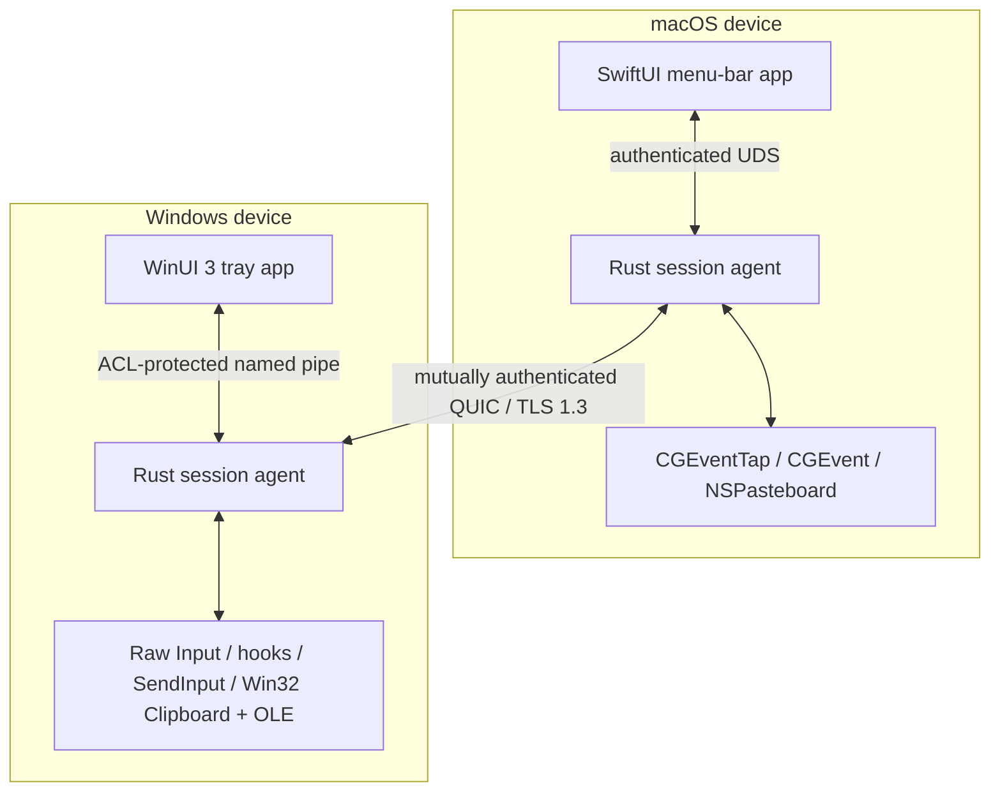

<!-- doc-id: architecture; lang: en; revision: 1 -->

# Architecture

[English](architecture.md) · [Русский](architecture.ru.md)

This document defines the intended architecture. It becomes binding only through implemented ADRs and tested code.

## System boundaries

Each device runs a native UI and an unprivileged Rust session agent. The UI owns user interaction and OS permission guidance. The agent owns network identity, pairing, session state, transport, input routing, clipboard, and transfers.

No hosted control plane, account service, relay, or telemetry collector is required for normal operation.

## Planned Rust workspace

| Crate | Responsibility |
| --- | --- |
| `nodavo-protocol` | Versioned messages, limits, capabilities, error model, golden vectors |
| `nodavo-transport` | QUIC, streams, datagrams, reconnect, deadlines, backpressure |
| `nodavo-identity` | Ed25519 device identity, pairing, pinning, grants, revocation |
| `nodavo-discovery` | mDNS advertisement/browse and manual address fallback |
| `nodavo-session` | Peer lifecycle, focus ownership lease, switching and recovery |
| `nodavo-input` | Canonical HID events, mappings, coordinate and modifier state |
| `nodavo-clipboard` | Text/HTML/image normalization, versioning, ownership and limits |
| `nodavo-transfer` | Manifests, chunks, staging, BLAKE3, resume, quota and finalize |
| `nodavo-platform-macos` | Capture, injection, permissions, displays, pasteboard and drag APIs |
| `nodavo-platform-windows` | Capture, injection, sessions, displays, clipboard and OLE APIs |
| `nodavo-local-ipc` | Authenticated UI ↔ agent protocol and OS access controls |
| `nodavo-agent` | Process orchestration and lifecycle |
| `nodavo-update` | Signed manifests, channels, verification and rollback metadata |

Crates use dependency injection at platform and transport boundaries. Tests can replace both with deterministic virtual adapters.

## Transport model

One authenticated QUIC connection carries independent channels:

- **Control stream:** protocol negotiation, capabilities, focus lease, display graph, liveness and errors.
- **Reliable input stream:** key/button down/up, critical modifier state and forced release.
- **Datagrams:** pointer motion and high-frequency scrolling with sequence numbers and latest-wins behavior.
- **Clipboard streams:** one bounded stream per clipboard revision and MIME representation.
- **File streams:** manifest control plus one unidirectional stream per file.

When QUIC datagrams are unavailable, pointer motion falls back to a short-lived reliable stream without changing security.

## Input model

- Physical keys use HID Usage IDs plus modifier state.
- Text/Unicode fallback handles layout-sensitive entry and future IME support.
- Pointer coordinates are normalized per display and transformed using the destination display scale.
- Every event includes session, origin, sequence, and capability context.
- Injected events are tagged or suppressed so they cannot re-enter capture.
- A single focus ownership lease prevents simultaneous routing loops.

On disconnect, timeout, lock, sleep, crash, or emergency stop, both sides release all tracked keys/buttons and restore local cursor ownership.

## Discovery and pairing

1. mDNS publishes a minimal, non-sensitive service record.
2. A peer opens an untrusted QUIC session with an ephemeral identity.
3. Both UIs display the same short authentication string.
4. The user confirms the match on both devices.
5. Devices exchange persistent public identities and explicit capability grants.
6. Future sessions require mutual proof of the pinned identities.

Private keys are stored in macOS Keychain and Windows DPAPI/CNG-backed storage. Discovery metadata is never accepted as identity proof.

## Clipboard and files

Clipboard synchronization is revisioned and content-addressed to prevent loops. Content is transferred only when its capability is enabled. Planned types are UTF-8 text, HTML, PNG/BMP, and file lists.

Files are written to a private staging directory, bounded by quotas, validated against traversal and unsafe links, hashed with BLAKE3, and atomically finalized after explicit destination policy. Received content is never auto-opened.

Finder ↔ Explorer drag/drop is an M0 research gate. If native drag APIs cannot be made reliable and safe, 1.0 will expose an explicit transfer queue rather than simulate misleading drag/drop.

## Process privilege

The default 1.0 agent runs in the user session. A privileged Windows service is excluded because login/UAC secure-desktop control would significantly increase the attack surface. Any future privileged component requires a separate threat model and capability boundary.

## Observability

Local structured logs contain event categories, timings, bounded error codes, and ephemeral correlation IDs—not keystrokes, clipboard data, file contents, private filenames, keys, or stable network identifiers. Crash reporting and telemetry remain disabled until explicit opt-in.

