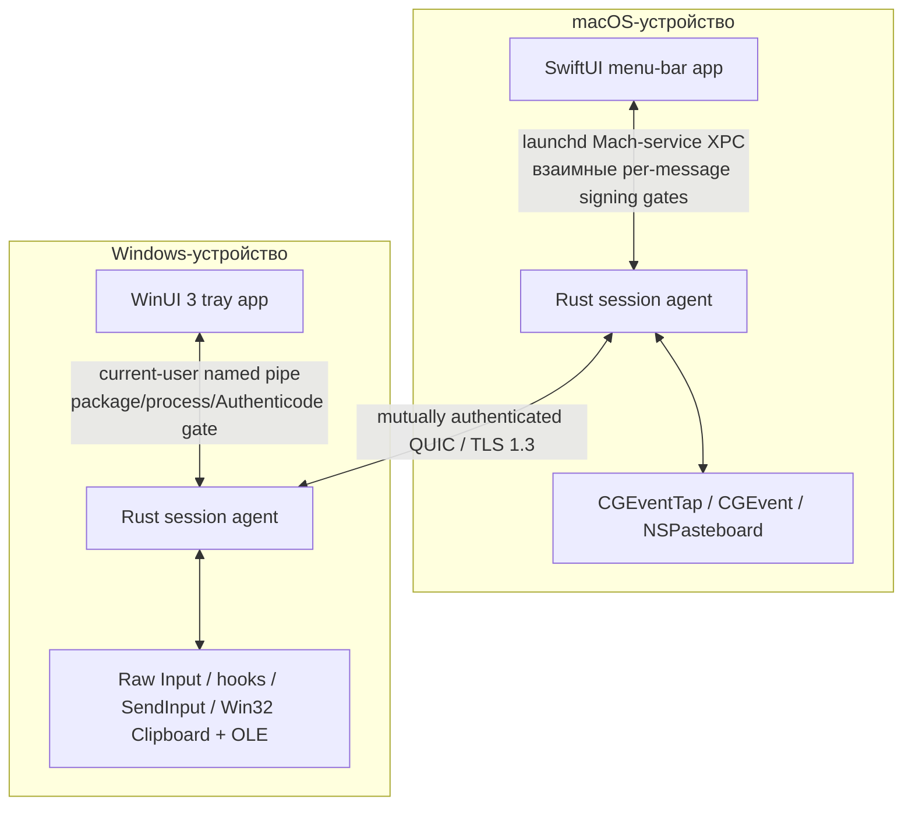

<!-- doc-id: architecture; lang: ru; translation-of: architecture.md; revision: 12 -->

# Архитектура

[English](architecture.md) · [Русский](architecture.ru.md)

Документ описывает целевую архитектуру. Обязательной она становится только через реализованные ADR и проверенный код.

## Границы системы

На каждом устройстве работает нативный UI и непривилегированный Rust session agent. UI отвечает за взаимодействие с пользователем и выдачу OS permissions. Agent владеет network identity, pairing, состоянием сессии, transport, input routing, clipboard и transfers.

Для обычной работы не требуется hosted control plane, account service, relay или telemetry collector.

## Планируемый Rust workspace

| Crate | Ответственность |
| --- | --- |
| `nodavo-protocol` | Версионированные messages, limits, capabilities, errors и golden vectors |
| `nodavo-transport` | QUIC, streams, datagrams, reconnect, deadlines и backpressure |
| `nodavo-identity` | Ed25519 identity, pairing, pinning, grants и revocation |
| `nodavo-discovery` | mDNS advertisement/browse и manual address fallback |
| `nodavo-session` | Peer lifecycle, focus ownership lease, switching и recovery |
| `nodavo-input` | Canonical HID events, mappings, coordinates и modifier state |
| `nodavo-clipboard` | Text/HTML/image normalization, revisions, ownership и limits |
| `nodavo-transfer` | Manifests, chunks, staging, BLAKE3, resume, quota и finalize |
| `nodavo-platform-macos` | Capture, injection, permissions, displays, pasteboard, Keychain, signed local-IPC policy и validation-only sealed update bundles |
| `nodavo-platform-windows` | Capture, injection, sessions, displays, clipboard, OLE, private update staging и read-only Appx inspection |
| `nodavo-local-ipc` | Authenticated UI ↔ agent protocol и OS access controls |
| `nodavo-agent` | Process orchestration и lifecycle |
| `nodavo-update` | Signed manifests, verification, staging contracts, encode-only одноразовый handoff для обычных callers и feature-gated reducer внешнего supervisor |

Platform и transport boundaries используют dependency injection, чтобы тесты заменяли их детерминированными virtual adapters.

Activation обновления намеренно находится вне работающих UI и agent. После verified staging и отдельного решения **Установить и перезапустить** handoff через обычный API можно получить только путём потребления точной `ReadyToInstall` session. Его фиксированный bounded codec переносит лишь ненулевой one-shot request ID и точный исходный signed manifest envelope; он не может переносить выбранные caller path, plan, artifact name, transaction, attempt, phase или action. Default-сборка agent может кодировать этот opaque request, но исключает decoding handoff и все APIs supervisor host, admission, reducer и actions. Repository CI и packaging macOS/Windows отклоняют non-default feature `supervisor-host` в agent artifacts. Это только packaging/build trust boundary; реальный supervisor всё равно обязан взаимно аутентифицировать process и текущую установку, удерживать exclusive protected transaction и аутентифицировать persistent state.

С feature `supervisor-host` initial admission предварительно резервирует request без его durable consumption, затем аутентифицирует точные текущие target/version, загружает свежий rollback floor, authoritative повторно проверяет исходный signed envelope, локально выводит plan и заново открывает и хэширует точный sealed content-addressed artifact. Сгенерированные supervisor identities transaction и old-process attempt сохраняются вместе с request ID в schema 3 journal. Request tombstone, exact old-process binding и journal должны быть атомарно закоммичены и перечитаны через аутентифицированное хранилище до выполнения reducer. После вызова persistence ошибка или неточное чтение означают commit ambiguity: admission и lock остаются закрытыми, и только recovery через аутентифицированное хранилище может установить, разрешены ли retry или action.

После этого source-only reducer разрешает по одному уже durable external effect и связывает точный evidence candidate, predecessor, process attempt, timeout, health и rollback floor. Platform crates пока останавливаются на границе validation/staging: macOS удерживает sealed signed universal tree, но не предоставляет replacement primitive, а Windows выполняет приватный staging и Appx inspection без deployment. Отдельно упакованный supervisor executable, authenticated supervisor IPC, защищённые persistent stores, activation adapters, process wiring для restart/health/rollback и физическая power-loss квалификация ещё отсутствуют.

## Модель транспорта

Одно authenticated QUIC-соединение содержит независимые каналы:

- **Control stream:** protocol negotiation, capabilities, focus lease, display graph, liveness и errors.
- **Reliable input stream:** key/button down/up, critical modifier state и forced release.
- **Datagrams:** pointer motion и high-frequency scrolling с sequence и latest-wins поведением.
- **Clipboard streams:** отдельный bounded stream на revision и MIME representation.
- **File streams:** manifest control и отдельный unidirectional stream на файл.

Если QUIC datagrams недоступны, движения указателя переходят на короткий reliable stream без снижения безопасности.

## Модель ввода

- Physical keys передаются как HID Usage IDs и modifier state.
- Text/Unicode fallback обслуживает layout-sensitive ввод и будущий IME.
- Pointer coordinates нормализуются на display и преобразуются с учётом scale целевого экрана.
- Event содержит session, origin, sequence и capability context.
- Каждый input event также содержит ненулевой identifier активной focus lease. Control, reliable input и replaceable input используют отдельные sequence lanes, поэтому overtaking датаграммы не может сделать release клавиши устаревшим.
- Injected events маркируются или подавляются и не возвращаются в capture.
- Единственный focus ownership lease предотвращает одновременные routing loops.
- Capture suppression по умолчанию выключен и включается только при forwarding под этой lease. Обычный возврат focus сохраняет authenticated connection готовым для управления в обратную сторону.

При disconnect, timeout, lock, sleep, crash или emergency stop обе стороны освобождают tracked keys/buttons и возвращают локальный cursor ownership.

Display hot-plug является session transaction, а не изменением geometry на месте. Platform callbacks только помечают coalesced dirty generation. Владелец session закрывает routing admission, дренирует уже принятый input под старой lease, возвращает focus локально, проверяет стабильный ограниченный полный graph со свежими process-local identities, заменяет active-only native/session map и публикует новую topology revision. Новый focus недоступен до acknowledgement точной revision. Повторные изменения сохраняют только последнюю candidate и не продлевают фиксированный refresh deadline; safety, revoke и disconnect остаются более приоритетными transitions.

Capture и injection macOS используют один immutable process snapshot из CoreGraphics. Capture и injection Windows используют один process-singleton display service с per-monitor-v2 awareness, DisplayConfig identities, ранним broadcast wake и authoritative polling. Обе платформы связывают suppression с callback/admission barrier, поэтому input нельзя принять удалённо после его возврата локальной OS. Native owners после timeout poison’ят restart в этом process вместо допуска пересекающихся capture, hooks или injectors.

## Discovery и pairing

1. mDNS публикует минимальную несекретную service record.
2. Ограниченный неаутентифицированный TCP preflight обменивается по этому адресу только краткоживущими метаданными временного сертификата.
3. Каждая сторона закрепляет точные metadata до установления временной QUIC-сессии pairing с TLS 1.3.
4. Оба UI показывают одинаковую short authentication string, связанную с TLS exporter и полным role-ordered transcript постоянного trust.
5. Пользователь подтверждает совпадение на обеих машинах.
6. Устройства обмениваются persistent public identities и явными capability grants.
7. Будущие сессии требуют mutual proof pinned identities.

Private keys хранятся в macOS Keychain и Windows DPAPI/CNG-backed storage. Discovery metadata никогда не используется как identity proof.

## Буфер и файлы

Clipboard synchronization использует revisions и content addressing для предотвращения loops. Контент передаётся только при включённой capability. Планируемые типы: UTF-8 text, HTML, PNG/BMP и file lists.

Файлы пишутся в private staging directory, ограничиваются quota, проверяются против traversal/unsafe links и хэшируются BLAKE3. Ограниченный durable-журнал хранит только точные contiguous offsets; возобновление после перезапуска требует тот же аутентифицированный manifest и обрезает недолговечный tail. Финальная публикация отказывается перезаписывать существующее назначение. Полученный контент не открывается автоматически.

Transfer execution и public presentation имеют разных owners. Short-held process registry допускает не более 128 nonterminal rows и хранит не более 32 terminal rows; он выдаёт случайный local UUID, который не попадает в peer protocol, и никогда не раскрывает wire transfer UUID. Public snapshot содержит только direction, phase, ограниченные byte counters, возможность cancellation и фиксированную failure category. Outbound bytes продвигаются после принятия reliable frame, inbound bytes — после durable staging write, а completion — только после durable publication и нужного authenticated acknowledgement. Targeted cancellation линеаризуется с finalization и сообщает `cancelled` только после успешного local cleanup.

Каждый authenticated peer открывает private no-follow staging namespace, производную от его persistent device identity. Второй peer не может resume или discard тот же wire UUID, а legacy unscoped pre-alpha staging не мигрируется. Process-lifetime completed/cancelled tombstones не дают reannouncement после reconnect создать новый public transfer. Identity retention также ограничен: registry принимает не более 4 096 lifetime generations, а peer/direction/wire ledger — 8 192 entries. Точный retained replay остаётся idempotent на capacity, а novel identity fail-closed до mutation; identities никогда не выбрасываются молча и не переиспользуются. Выбранные outbound sources и public history по-прежнему являются process-lifetime state; durable восстановление source/history между перезапусками агента остаётся release gate.

Finder ↔ Explorer drag/drop является M0 research gate. Если native drag APIs нельзя сделать надёжными и безопасными, 1.0 предложит явную transfer queue вместо имитации drag/drop.

## Привилегии процессов

Agent 1.0 по умолчанию работает в user session. Privileged Windows service исключён: управление login/UAC secure desktop значительно расширит attack surface. Будущий privileged component потребует отдельный threat model и capability boundary.

## Локальные сигналы готовности

Через аутентифицированный UI-протокол агент публикует один ограниченный snapshot готовности без пользовательского контента. Локальный ввод, обнаружение локальных дисплеев и синхронизация аутентифицированной peer-топологии — независимые сигналы: доступный дисплей не означает, что layout второго устройства готов. Peer-топология получает состояние `synchronizing` при установлении соединения и становится готовой только после установки точной удалённой topology и совпадающего acknowledgement локальной revision; любой teardown или recovery возвращает `not_connected`.

Platform probes выполняются вне async dispatcher с конечным deadline и коротким cache. Они проверяют только trust/default-desktop state, обнаружение дисплеев, capability API и создание prerequisite injector, который не отправляет events; capture runtime не создаётся и не регистрируется, ввод не route, suppress или inject. Поэтому `ready` означает текущую доступность локальных prerequisites, а не выполненный live capture. Явное действие macOS запрашивает Accessibility от identity агента, игнорирует возвращаемое prompt API значение и сразу повторно проверяет фактический trust. В Windows нет Accessibility action: не-default или secure input desktop только обозначается как blocked, без предложения elevation или secure-desktop control. Public snapshot не содержит paths, process IDs, native display IDs, desktop names, peer identifiers или permission-prompt metadata.

## Доверие локальных процессов

Release-путь macOS использует пользовательский launchd Mach service `dev.nodavo.agent.ipc`. До activation агент настраивает listener и каждое принятое connection точным code-signing requirement UI; Swift UI до activation client устанавливает взаимный точный requirement агента. XPC проверяет каждое полученное сообщение. Оба requirements связывают Developer ID chain, Team ID времени компиляции, точные identifiers и application/team entitlements, а также отсутствие `get-task-allow`. XPC dictionaries с одним значением переносят существующий bounded deny-unknown JSON contract в общий exhaustive dispatcher агента.

Предыдущий UDS audit-token design отозван, потому что текущая task identity из `LOCAL_PEERTOKEN` не определяет происхождение bytes, поставленных в очередь до exec. Development packaging намеренно сохраняет этот приватный same-UID UDS только за non-default feature и помечает артефакт unsafe/non-distributable; release Mach service в нём не объявляется. Release не имеет UDS fallback или environment path override. Взаимный enforcement реализован в source, а live evidence production signing/notarization и installed mutual runtime остаются открытыми release gates. Payload и metadata процесса не логируются.

В Windows каждое current-user named-pipe connection переносит ровно один request и response. Server удерживает связанные с connection handles pipe, process, token и executable точного packaged UI. До отправки UI аутентифицирует собственные compile-time package/PFN/AUMID и installed content root, затем удерживает server process, token, точный non-reparse agent executable внутри этого root и закреплённый Authenticode evidence. В обоих направлениях проверяются session/logon lineage и стабильность process/token до использования аутентифицированного результата. Для отдельно запущенного Rust agent не заявляется package identity; взаимным trust anchor служат его точный installed path и signature. Development и release UI package identities разделены compile-time policies; unpackaged или unconfigured peers fail closed, а packaging подписывает и проверяет оба executables. Policy покрыта source и cross-target checks, но installed-MSIX behavior, production publisher/signing/timestamp credentials и реальное выполнение x64/ARM64 остаются release gates. Эта граница отклоняет независимый same-user process, занявший endpoint. Она не создаёт отдельный Windows principal: invasive access к handles или memory авторизованного process явно находится вне заявленной threat model 1.0.

## Наблюдаемость

Локальные structured logs содержат категории событий, timings, bounded error codes и ephemeral correlation IDs, но не keystrokes, clipboard data, file contents, private filenames, keys и stable network identifiers. Crash reporting и telemetry остаются выключенными до explicit opt-in.
