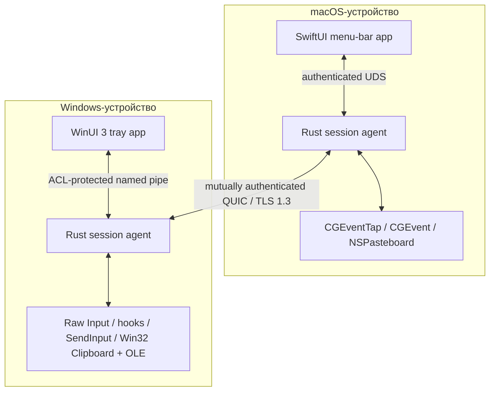

<!-- doc-id: architecture; lang: ru; translation-of: architecture.md; revision: 1 -->

# Архитектура

[English](architecture.md) · [Русский](architecture.ru.md)

Документ описывает целевую архитектуру. Обязательной она становится только через реализованные ADR и проверенный код.

## Границы системы

На каждом устройстве работает нативный UI и непривилегированный Rust session agent. UI отвечает за взаимодействие с пользователем и выдачу OS permissions. Agent владеет network identity, pairing, состоянием сессии, transport, input routing, clipboard и transfers.

Для обычной работы не требуется hosted control plane, account service, relay или telemetry collector.

## Планируемый Rust workspace

| Crate | Ответственность |
| --- | --- |
| `nodavo-protocol` | Версионированные messages, limits, capabilities, errors и golden vectors |
| `nodavo-transport` | QUIC, streams, datagrams, reconnect, deadlines и backpressure |
| `nodavo-identity` | Ed25519 identity, pairing, pinning, grants и revocation |
| `nodavo-discovery` | mDNS advertisement/browse и manual address fallback |
| `nodavo-session` | Peer lifecycle, focus ownership lease, switching и recovery |
| `nodavo-input` | Canonical HID events, mappings, coordinates и modifier state |
| `nodavo-clipboard` | Text/HTML/image normalization, revisions, ownership и limits |
| `nodavo-transfer` | Manifests, chunks, staging, BLAKE3, resume, quota и finalize |
| `nodavo-platform-macos` | Capture, injection, permissions, displays, pasteboard и drag APIs |
| `nodavo-platform-windows` | Capture, injection, sessions, displays, clipboard и OLE APIs |
| `nodavo-local-ipc` | Authenticated UI ↔ agent protocol и OS access controls |
| `nodavo-agent` | Process orchestration и lifecycle |
| `nodavo-update` | Signed manifests, channels, verification и rollback metadata |

Platform и transport boundaries используют dependency injection, чтобы тесты заменяли их детерминированными virtual adapters.

## Модель транспорта

Одно authenticated QUIC-соединение содержит независимые каналы:

- **Control stream:** protocol negotiation, capabilities, focus lease, display graph, liveness и errors.
- **Reliable input stream:** key/button down/up, critical modifier state и forced release.
- **Datagrams:** pointer motion и high-frequency scrolling с sequence и latest-wins поведением.
- **Clipboard streams:** отдельный bounded stream на revision и MIME representation.
- **File streams:** manifest control и отдельный unidirectional stream на файл.

Если QUIC datagrams недоступны, движения указателя переходят на короткий reliable stream без снижения безопасности.

## Модель ввода

- Physical keys передаются как HID Usage IDs и modifier state.
- Text/Unicode fallback обслуживает layout-sensitive ввод и будущий IME.
- Pointer coordinates нормализуются на display и преобразуются с учётом scale целевого экрана.
- Event содержит session, origin, sequence и capability context.
- Injected events маркируются или подавляются и не возвращаются в capture.
- Единственный focus ownership lease предотвращает одновременные routing loops.

При disconnect, timeout, lock, sleep, crash или emergency stop обе стороны освобождают tracked keys/buttons и возвращают локальный cursor ownership.

## Discovery и pairing

1. mDNS публикует минимальную несекретную service record.
2. Peer открывает untrusted QUIC-сессию с временной identity.
3. Оба UI показывают одинаковую short authentication string.
4. Пользователь подтверждает совпадение на обеих машинах.
5. Устройства обмениваются persistent public identities и явными capability grants.
6. Будущие сессии требуют взаимного доказательства pinned identities.

Private keys хранятся в macOS Keychain и Windows DPAPI/CNG-backed storage. Discovery metadata никогда не используется как identity proof.

## Буфер и файлы

Clipboard synchronization использует revisions и content addressing для предотвращения loops. Контент передаётся только при включённой capability. Планируемые типы: UTF-8 text, HTML, PNG/BMP и file lists.

Файлы пишутся в private staging directory, ограничиваются quota, проверяются против traversal и unsafe links, хэшируются BLAKE3 и атомарно перемещаются после выбора destination policy. Полученный контент не открывается автоматически.

Finder ↔ Explorer drag/drop является M0 research gate. Если native drag APIs нельзя сделать надёжными и безопасными, 1.0 предложит явную transfer queue вместо имитации drag/drop.

## Привилегии процессов

Agent 1.0 по умолчанию работает в user session. Privileged Windows service исключён: управление login/UAC secure desktop значительно расширит attack surface. Будущий privileged component потребует отдельный threat model и capability boundary.

## Наблюдаемость

Локальные structured logs содержат категории событий, timings, bounded error codes и ephemeral correlation IDs, но не keystrokes, clipboard data, file contents, private filenames, keys и stable network identifiers. Crash reporting и telemetry остаются выключенными до explicit opt-in.

