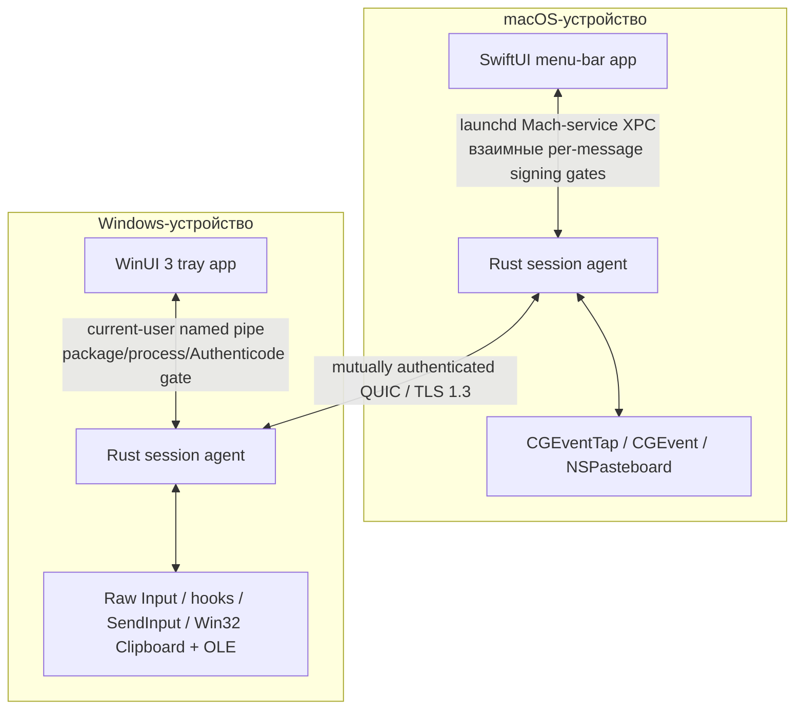

<!-- doc-id: architecture; lang: ru; translation-of: architecture.md; revision: 7 -->

# Архитектура

[English](architecture.md) · [Русский](architecture.ru.md)

Документ описывает целевую архитектуру. Обязательной она становится только через реализованные ADR и проверенный код.

## Границы системы

На каждом устройстве работает нативный UI и непривилегированный Rust session agent. UI отвечает за взаимодействие с пользователем и выдачу OS permissions. Agent владеет network identity, pairing, состоянием сессии, transport, input routing, clipboard и transfers.

Для обычной работы не требуется hosted control plane, account service, relay или telemetry collector.

## Планируемый Rust workspace

| Crate | Ответственность |
| --- | --- |
| `nodavo-protocol` | Версионированные messages, limits, capabilities, errors и golden vectors |
| `nodavo-transport` | QUIC, streams, datagrams, reconnect, deadlines и backpressure |
| `nodavo-identity` | Ed25519 identity, pairing, pinning, grants и revocation |
| `nodavo-discovery` | mDNS advertisement/browse и manual address fallback |
| `nodavo-session` | Peer lifecycle, focus ownership lease, switching и recovery |
| `nodavo-input` | Canonical HID events, mappings, coordinates и modifier state |
| `nodavo-clipboard` | Text/HTML/image normalization, revisions, ownership и limits |
| `nodavo-transfer` | Manifests, chunks, staging, BLAKE3, resume, quota и finalize |
| `nodavo-platform-macos` | Capture, injection, permissions, displays, pasteboard, Keychain и signed local-IPC peer policy |
| `nodavo-platform-windows` | Capture, injection, sessions, displays, clipboard и OLE APIs |
| `nodavo-local-ipc` | Authenticated UI ↔ agent protocol и OS access controls |
| `nodavo-agent` | Process orchestration и lifecycle |
| `nodavo-update` | Signed manifests, channels, verification и rollback metadata |

Platform и transport boundaries используют dependency injection, чтобы тесты заменяли их детерминированными virtual adapters.

## Модель транспорта

Одно authenticated QUIC-соединение содержит независимые каналы:

- **Control stream:** protocol negotiation, capabilities, focus lease, display graph, liveness и errors.
- **Reliable input stream:** key/button down/up, critical modifier state и forced release.
- **Datagrams:** pointer motion и high-frequency scrolling с sequence и latest-wins поведением.
- **Clipboard streams:** отдельный bounded stream на revision и MIME representation.
- **File streams:** manifest control и отдельный unidirectional stream на файл.

Если QUIC datagrams недоступны, движения указателя переходят на короткий reliable stream без снижения безопасности.

## Модель ввода

- Physical keys передаются как HID Usage IDs и modifier state.
- Text/Unicode fallback обслуживает layout-sensitive ввод и будущий IME.
- Pointer coordinates нормализуются на display и преобразуются с учётом scale целевого экрана.
- Event содержит session, origin, sequence и capability context.
- Каждый input event также содержит ненулевой identifier активной focus lease. Control, reliable input и replaceable input используют отдельные sequence lanes, поэтому overtaking датаграммы не может сделать release клавиши устаревшим.
- Injected events маркируются или подавляются и не возвращаются в capture.
- Единственный focus ownership lease предотвращает одновременные routing loops.
- Capture suppression по умолчанию выключен и включается только при forwarding под этой lease. Обычный возврат focus сохраняет authenticated connection готовым для управления в обратную сторону.

При disconnect, timeout, lock, sleep, crash или emergency stop обе стороны освобождают tracked keys/buttons и возвращают локальный cursor ownership.

## Discovery и pairing

1. mDNS публикует минимальную несекретную service record.
2. Ограниченный неаутентифицированный TCP preflight обменивается по этому адресу только краткоживущими метаданными временного сертификата.
3. Каждая сторона закрепляет точные metadata до установления временной QUIC-сессии pairing с TLS 1.3.
4. Оба UI показывают одинаковую short authentication string, связанную с TLS exporter и полным role-ordered transcript постоянного trust.
5. Пользователь подтверждает совпадение на обеих машинах.
6. Устройства обмениваются persistent public identities и явными capability grants.
7. Будущие сессии требуют mutual proof pinned identities.

Private keys хранятся в macOS Keychain и Windows DPAPI/CNG-backed storage. Discovery metadata никогда не используется как identity proof.

## Буфер и файлы

Clipboard synchronization использует revisions и content addressing для предотвращения loops. Контент передаётся только при включённой capability. Планируемые типы: UTF-8 text, HTML, PNG/BMP и file lists.

Файлы пишутся в private staging directory, ограничиваются quota, проверяются против traversal/unsafe links и хэшируются BLAKE3. Ограниченный durable-журнал хранит только точные contiguous offsets; возобновление после перезапуска требует тот же аутентифицированный manifest и обрезает недолговечный tail. Финальная публикация отказывается перезаписывать существующее назначение. Полученный контент не открывается автоматически.

Finder ↔ Explorer drag/drop является M0 research gate. Если native drag APIs нельзя сделать надёжными и безопасными, 1.0 предложит явную transfer queue вместо имитации drag/drop.

## Привилегии процессов

Agent 1.0 по умолчанию работает в user session. Privileged Windows service исключён: управление login/UAC secure desktop значительно расширит attack surface. Будущий privileged component потребует отдельный threat model и capability boundary.

## Доверие локальных процессов

Release-путь macOS использует пользовательский launchd Mach service `dev.nodavo.agent.ipc`. До activation агент настраивает listener и каждое принятое connection точным code-signing requirement UI; Swift UI до activation client устанавливает взаимный точный requirement агента. XPC проверяет каждое полученное сообщение. Оба requirements связывают Developer ID chain, Team ID времени компиляции, точные identifiers и application/team entitlements, а также отсутствие `get-task-allow`. XPC dictionaries с одним значением переносят существующий bounded deny-unknown JSON contract в общий exhaustive dispatcher агента.

Предыдущий UDS audit-token design отозван, потому что текущая task identity из `LOCAL_PEERTOKEN` не определяет происхождение bytes, поставленных в очередь до exec. Development packaging намеренно сохраняет этот приватный same-UID UDS только за non-default feature и помечает артефакт unsafe/non-distributable; release Mach service в нём не объявляется. Release не имеет UDS fallback или environment path override. Взаимный enforcement реализован в source, а live evidence production signing/notarization и installed mutual runtime остаются открытыми release gates. Payload и metadata процесса не логируются.

В Windows каждое current-user named-pipe connection переносит ровно один request и response. Server удерживает связанные с connection handles pipe, process, token и executable точного packaged UI. До отправки UI аутентифицирует собственные compile-time package/PFN/AUMID и installed content root, затем удерживает server process, token, точный non-reparse agent executable внутри этого root и закреплённый Authenticode evidence. В обоих направлениях проверяются session/logon lineage и стабильность process/token до использования аутентифицированного результата. Для отдельно запущенного Rust agent не заявляется package identity; взаимным trust anchor служат его точный installed path и signature. Development и release UI package identities разделены compile-time policies; unpackaged или unconfigured peers fail closed, а packaging подписывает и проверяет оба executables. Policy покрыта source и cross-target checks, но installed-MSIX behavior, production publisher/signing/timestamp credentials и реальное выполнение x64/ARM64 остаются release gates. Эта граница отклоняет независимый same-user process, занявший endpoint. Она не создаёт отдельный Windows principal: invasive access к handles или memory авторизованного process явно находится вне заявленной threat model 1.0.

## Наблюдаемость

Локальные structured logs содержат категории событий, timings, bounded error codes и ephemeral correlation IDs, но не keystrokes, clipboard data, file contents, private filenames, keys и stable network identifiers. Crash reporting и telemetry остаются выключенными до explicit opt-in.
